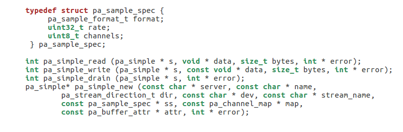

# VoIP using TCP/IP Client-Server Model
Implementation of IP Phone where you can hear both sides clearly.
We were asked to use "Pulseaudio" available for linux for recording and playback.

The following are the APIs used in the code-

## Logic for client
   * The client initiates a connection with the server using TCP/IP sockets
   * After the connection is established,it is ready to record data and wite it to a data buffer that is being read by the server simultaneously.
## Logic for server
   * The server accepts any incoming requests
   * As soon as a connection is established, it waits for data to be read and played.
