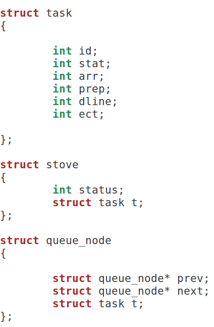
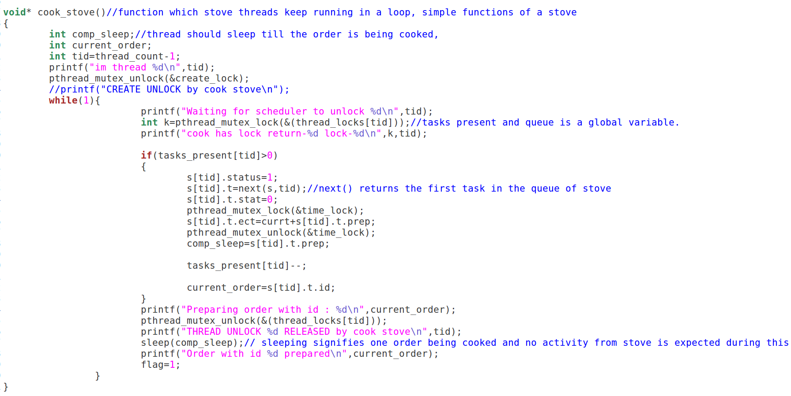
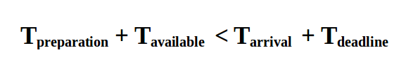

# KITCHEN ORDER SCHEDULER
## Problem
Every restaurant kitchen receives orders with a particular deadline. The success of any kitchen in such a scenario is entirely dependent on effective processing of incoming orders. This project implements a scheduling system such that-
1. the order is processed within the deadline
2. the order is processed efficiently
wherein the kitchen has multiple stoves(3 in this case) and the ordering system recieves order from either a file or a client-server based system. In the latter case the system simulating a kitchen resides in server source code.

## Solution
Just take a real life scenario - say a billing counter at a super market.
* we first look for an empty counter
* if all counters are busy, we look for the one with the shortest queue 

The only difference is that these orders have a deadline. We can assume that preparation time of an order will be less than the deadline. Hence, if a stove(analogous to counter) is free, we can assign it the order and it will be completed within the deadline. But if the order has to be added to a queue, preferably the shortest queue,(analogous to joing the shortest queue in the billing counter), then we must also check if the order can be completed within the deadline given there is a 'waiting time' also before the order starts getting prepared.

## Implementation
### Structures
We have three structures - task, stove and queue_node.

### Threads
We want threads in order to replicate the live functioning of a stove. There are as many threads as number of stoves in the kitchen. This thread is responsible to process the orders, and once the order is prepared, request for the next order waiting in its queue. In case, the queue is empty, it will wait indefinitely until a new order is added to the queue.

### Locks
We have two different kinds of locks here, the first kind are thread locks which block threads(3, analogous to stoves) from accesing or modifying the same resources which the scheduler uses. Intuitively one can tell that these resources would constitute a scheduling queue. In our construct each stove or cooking station has its own queue which stores the order of food orders to be prepared. Each stove can delete orders from its queue after taking them up for preparation. These queues are populated by the scheduler based on rules which we think would lead to efficient utilization and earliest deliveries.

The second kind of lock is a time lock which has been kept to ensure that there are no simultaenous access/modifications to a real clock counter leading to a race condition.
### allot()
This function is fundamental to our code as it encompasses the implementation for the scheduler.This function is responsible for assigning orders to one of the stoves. 

Condition to be checked;

## Gaps
* There might be cases wherein an order received latest has the earliest deadline. There is a possibility that if a currently being processed order is halted and sent back to the queue, and this order is taken up, it can be delivered within deadline. But then, we have to ensure that all the orders that were already in the queue still can be serviced within the deadline(as now an extra waiting time equal to the preparation time of this emergency order is added). This makes the code complex.

## Challenges
*  Handling synchronization using locks can get confusing.
## Extra Info
